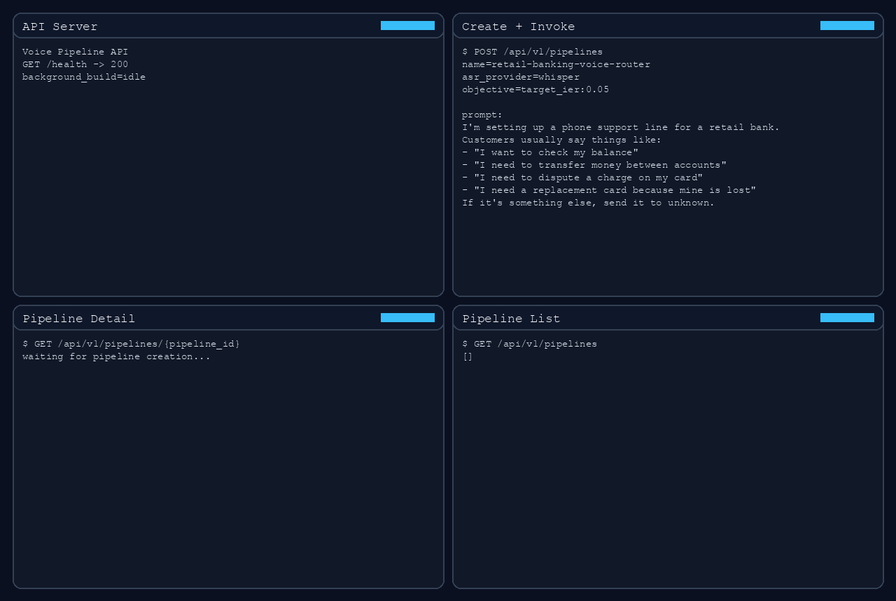
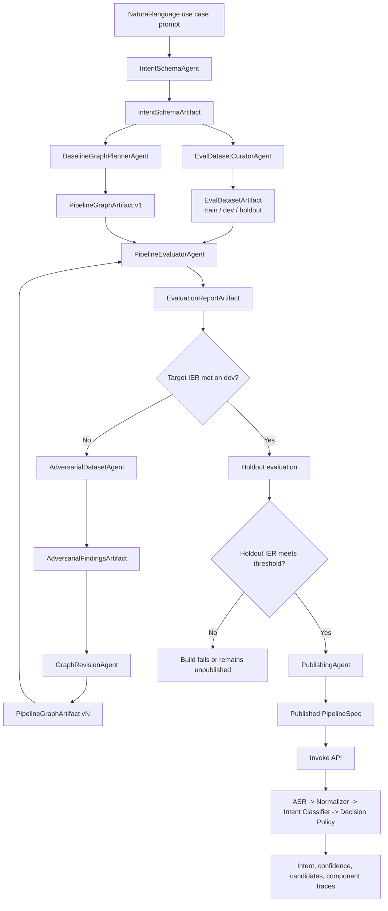

# On-Demand Voice Pipelines

Voice intent pipelines that optimize for intent error rate (IER) instead of word error rate (WER). You give the API a natural-language description of your use case, the system builds a pipeline around that intent space, evaluates it, and publishes a graph you can invoke with text or audio.



## What the demo shows

The demo is built around a realistic retail-banking support scenario:

- create a new pipeline from a normal human prompt
- monitor the pipeline build through the existing detail API
- watch the pipeline appear as `ready` in the list API
- send an audio sample to the published pipeline and inspect the output trace

The prompt used in the demo is intentionally non-technical:

```text
I'm setting up a phone support line for a retail bank.
Customers usually say things like:
- "I want to check my balance"
- "I need to transfer money between accounts"
- "I need to dispute a charge on my card"
- "I need a replacement card because mine is lost"
If it's something else, send it to unknown.
```

## Demo asset

The committed GIF at [four-pane-demo.gif](/Users/priyeshsrivastava/ondemand-voice-pipelines/four-pane-demo.gif) shows the full story in one view:

- top left: API server activity
- top right: pipeline creation and final invocation
- bottom left: `GET /api/v1/pipelines/{pipeline_id}` while the build is running
- bottom right: `GET /api/v1/pipelines` as the pipeline moves to `ready`

For a live demo, use the four public endpoints in this order:

1. `POST /api/v1/pipelines`
2. `GET /api/v1/pipelines/{pipeline_id}` until the build completes
3. `GET /api/v1/pipelines`
4. `POST /api/v1/pipelines/{pipeline_id}/invoke`

## Public API

- `GET /health`
- `GET /api/v1/pipelines`
- `POST /api/v1/pipelines`
- `GET /api/v1/pipelines/{pipeline_id}`
- `POST /api/v1/pipelines/{pipeline_id}/invoke`

The generated OpenAPI document is stored in [openapi.json](/Users/priyeshsrivastava/ondemand-voice-pipelines/openapi.json).

## What to inspect during generation

Use `GET /api/v1/pipelines/{pipeline_id}` while the build is running.

The most useful fields for narration are:

- `build_steps[]`: step-by-step progress through generation and publishing
- `artifact_history[]`: every persisted artifact with `build_phase`, `artifact_type`, `version`, and summary
- `intent_schema_artifact`: the intent contract derived from the user prompt
- `eval_dataset_artifact`: the grounded train/dev/holdout dataset
- `published_graph_artifact`: the assembled ASR, normalization, classification, and decision-policy components
- `latest_evaluation_report_artifact`: the measured IER and confusion data

Use `GET /api/v1/pipelines` after publication to show the pipeline in the active list with summary status and graph version.

Use `POST /api/v1/pipelines/{pipeline_id}/invoke` to show:

- transcript text
- normalized text
- detected intent
- confidence and intent candidates
- per-component traces

## Architecture



Typed artifacts are defined in [artifacts.py](/Users/priyeshsrivastava/ondemand-voice-pipelines/app/schemas/artifacts.py):

- `IntentSchemaArtifact`
- `EvalDatasetArtifact`
- `PipelineGraphArtifact`
- `EvaluationReportArtifact`
- `AdversarialFindingsArtifact`
- `PipelineSpec`
- `PipelineBuildStep`

## Audio invocation coverage

The invocation path accepts base64-encoded audio input. The natural-language end-to-end audio flow is covered by [test_voice_sample_e2e.py](/Users/priyeshsrivastava/ondemand-voice-pipelines/tests/test_endpoints/test_voice_sample_e2e.py) using a test-only ASR stub, so production code does not depend on committed demo audio fixtures.

## Local setup

```bash
python3 -m venv .venv
. .venv/bin/activate
pip install -e ".[dev]"
cp .env.example .env
uvicorn app.main:app --reload
```

For the real runtime path, apply [supabase_migration.sql](/Users/priyeshsrivastava/ondemand-voice-pipelines/supabase_migration.sql) in Supabase and configure `.env`.

## Tests

```bash
.venv/bin/pytest
```
