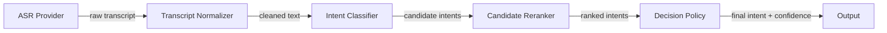
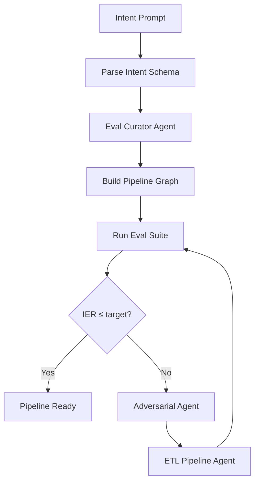

# A Pipeline That Evaluates Itself

Most voice pipelines are configured once and prayed over. A product manager writes an intent prompt. An engineer picks an ASR provider. Someone tests it with "check my balance" and "transfer me to an agent," watches both classify correctly, and ships it. The pipeline is now in production, untested against filler words, homophones, out-of-domain utterances, and the thousand ways real humans say the same thing differently.

What if the pipeline generated its own eval suite, ran it, and fixed what broke?

## The Core Mechanism

The system uses a multi-agent build loop. When you create a pipeline, you provide an intent prompt — a natural language description of what your callers might want. From that single prompt, the system:

1. **Parses intents** into a structured schema with definitions, examples, disambiguation rules, and out-of-scope boundaries
2. **Generates a diverse eval dataset** covering direct utterances, natural language variants, filler-word patterns, polite forms, and out-of-domain examples — split into train, dev, and immutable holdout sets
3. **Builds a component graph** — ASR → Normalizer → Intent Classifier → Candidate Reranker → Decision Policy — with each component independently configurable
4. **Runs the eval suite** against the pipeline, measuring IER per split, per intent, with a full confusion matrix
5. **Analyzes failures**, clusters them by confused intent pairs, generates adversarial examples targeting the failure modes, and proposes component-level fixes
6. **Iterates** until IER meets the target threshold or the iteration budget is exhausted

This is not prompt-and-pray. This is build-measure-fix, automated.

## Artifact-Driven, Not Prompt-Driven

Every agent in the system produces typed, versioned artifacts — not loose JSON, not unstructured text, not "whatever Claude said." Each artifact is a Pydantic model with explicit fields, refs to upstream artifacts, and a schema that the next agent in the chain can validate against.

```python
class IntentSchemaArtifact(BaseModel):
    artifact_id: str
    pipeline_id: str
    source_prompt: str
    fallback_intent: str = "unknown"
    intents: list[IntentDefinition]

class IntentDefinition(BaseModel):
    intent_name: str
    description: str
    positive_examples: list[str]
    negative_examples: list[str]
    disambiguation_rules: list[str]
    out_of_scope_examples: list[str]
```

Five artifact types flow through the build loop:

| Artifact | What It Contains | Produced By |
|----------|-----------------|-------------|
| `IntentSchemaArtifact` | Parsed intents with definitions, examples, disambiguation rules | Schema Parser |
| `EvalDatasetArtifact` | Test utterances with splits, phenomenon tags, confusable-with annotations | Eval Curator Agent |
| `PipelineGraphArtifact` | Component specs, edges, configuration for every pipeline stage | ETL Pipeline Agent |
| `EvaluationReportArtifact` | IER, confusion matrix, per-intent accuracy, hard cases with traces | Eval Runner |
| `AdversarialFindingsArtifact` | Failure clusters, proposed adversarial examples, component fix recommendations | Adversarial Agent |

Each artifact carries an `ArtifactRef` — a pointer with `artifact_id`, `artifact_type`, `pipeline_id`, and `version`. Artifacts reference their inputs explicitly. The `EvalDatasetArtifact` knows which `IntentSchemaArtifact` it was generated from. The `EvaluationReportArtifact` knows which `PipelineGraphArtifact` and `EvalDatasetArtifact` it evaluated. The `AdversarialFindingsArtifact` knows which `EvaluationReportArtifact` it analyzed.

```python
class ArtifactRef(BaseModel):
    artifact_id: str
    artifact_type: ArtifactType
    pipeline_id: str
    version: int
```

This is not incidental. Artifact lineage is what makes the improvement loop debuggable. When IER drops on iteration 3, you can trace backward: which adversarial examples were added? Which component config changed? Which failure cluster triggered the change? Without typed artifacts and explicit refs, the build loop is a black box. With them, it's an audit trail.

## The Component Graph

The pipeline is not a monolith. It's a directed graph of independently tunable components:



Each component has its own spec:

**ASR Component** — Provider, model, language, keyword hints, n-best count, endpointing config. The `keyword_hints` field is critical: domain-specific terms that the ASR would otherwise miss. These get updated by the adversarial agent when misclassifications trace back to transcription errors.

```python
class AsrComponentSpec(BaseModel):
    component_id: str
    provider: str
    model: str
    keyword_hints: list[str]
    n_best: int = 1
    endpointing_config: dict[str, Any]
```

**Transcript Normalizer** — Lowercase, strip fillers, punctuation policy, canonical replacements. The normalizer is where "gonna" becomes "going to" and "uhh" gets removed. These rules directly affect classifier performance and are tuned based on eval results.

**Intent Classifier** — Provider, model, system prompt, candidate count, few-shot examples, and a reference to the intent schema. The system prompt is the primary lever the ETL agent uses to improve IER — rewriting it based on failure analysis.

**Candidate Reranker** — Takes the top-k candidates from the classifier and applies a separate reranking prompt. This is where the system resolves near-ties between confusable intents.

**Decision Policy** — Confidence threshold, margin threshold (minimum gap between top-1 and top-2), fallback intent, abstain behavior. This is where the system decides "I'm not sure enough" and routes to a human.

```python
class DecisionPolicyComponentSpec(BaseModel):
    confidence_threshold: float = 0.7
    margin_threshold: float = 0.05
    fallback_intent: str = "unknown"
    allow_abstain: bool = True
    out_of_domain_strategy: str = "fallback_intent"
```

The edges between components are explicit:

```python
class PipelineEdge(BaseModel):
    from_component_id: str
    from_output_key: str
    to_component_id: str
    to_input_key: str
```

Why does the graph structure matter? Because when the adversarial agent finds a failure cluster — say, "cancel_subscription" confused with "billing_inquiry" — it needs to know *which component to fix*. If the ASR is garbling the word "cancel," the fix is `keyword_hints`. If the classifier prompt doesn't distinguish the two intents clearly enough, the fix is `system_prompt`. If the decision policy is routing low-confidence classifications instead of abstaining, the fix is `confidence_threshold`. Component isolation makes targeted fixes possible.

## What the Build Loop Actually Looks Like



The orchestrator drives this loop:

```python
for iteration in range(max_iters):
    current_ier = context.metrics.get("ier", 1.0)
    if current_ier <= ier_target:
        break

    # Adversarial agent red-teams via tool loop
    adv_result = await self._adversarial_agent.run(context)

    # Re-optimize with expanded eval set
    etl_result = await self._etl_agent.run(context)
```

Each iteration: measure → red-team → fix → re-measure. The adversarial agent adds hard examples. The ETL agent rewrites the classifier prompt. The eval suite runs again. IER either drops or it doesn't. If it doesn't drop after `max_iters`, the system stops and reports what it couldn't fix — including which failure clusters resisted improvement.

## What This Is Not

This is not AutoML for voice. The components are not swapped automatically from some search space. The architecture is fixed — ASR → Normalizer → Classifier → Reranker → Policy. What changes is the *configuration* of each component: the prompts, the thresholds, the hints, the rules.

This is not a training pipeline. No models are fine-tuned. The classifier is Claude, called via API, with a system prompt that gets iteratively refined. The improvement loop is prompt optimization, not weight optimization.

This is a *configuration search* guided by structured evaluation. The artifacts make the search legible. The component graph makes the search targeted. The eval loop makes the search measurable. That's the architecture.
